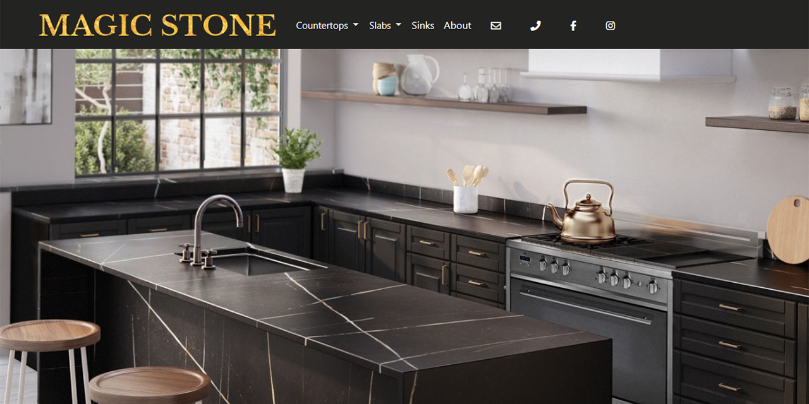

# MAGIC STONE
> Website for stone production company.  
> Full published website you may find at: [magicstone.ca](https://www.magicstone.ca/). <!-- If you have the project hosted somewhere, include the link here. -->

## Table of Contents
* [General Info](#general-information)
* [Technologies Used](#technologies-used)
* [Features](#features)
* [Screenshots](#screenshots)
* [Project Status](#project-status)
* [Acknowledgements](#acknowledgements)
* [Contact](#contact)

## General Information
- Moodboard with several options were provided to client.
- Following a chosen moodboard and discussed site dynamic and color preference, the design was made from the scratch.
- The Django web framework was chosen due to requirements of fast development and admin site panel.

## Technologies Used
- Python, Django
- HTML, SCSS / CSS, JavaScript

## Features
- Add project photos from admin panel
- Has magnifying glass to see stone print pattern

## Screenshots

<!-- If you have screenshots you'd like to share, include them here. -->

## Project Status
Project is: _complete_.

## Acknowledgements
This project is owned by MagicStone company and displaid only for portfolio purpose as was agreed.

## Contact
Created by [@KirillKriachenko](https://github.com/KirillKriachenko) - feel free to contact me!

